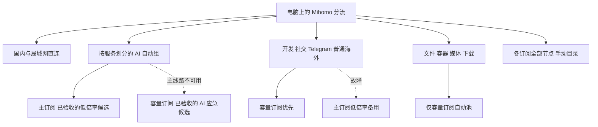

# Clash 多订阅分流实践

把多个机场订阅按用途组合起来：AI 使用已验收的低倍率出口，日常访问优先容量订阅，下载避免自动消耗昂贵线路，每个订阅的全部节点保留手动入口。

本项目来自一台 Windows 电脑的 Clash Verge Rev / Mihomo 配置实践。公开的是配置生成器、规则目录、测量工具和方法。真实订阅链接、服务器地址、密码、出口 IP、浏览记录及原始账单均不在仓库中。

## 能直接使用的内容

- **本地 YAML 配置生成器**：合并主订阅、容量订阅和可选临时订阅；真实凭据只写入被 Git 忽略的 `output/`。
- **30 个 AI 服务组**：23 个自动组、7 个手动组；每个自动服务与订阅组合使用独立文件来源和检查状态。
- **8 个普通业务组**：开发、GitHub API、社交、Telegram、通用海外、GitHub 文件、容器与依赖、媒体与下载。
- **全部节点目录**：未验收、高倍率和临时订阅节点仍可以手动使用。自动池按逐服务验收记录选择。
- **额度保护配置**：`--block-primary` 生成移除主订阅的配置；自动账单采集与后台锁定程序尚未包含在公开版。
- **真实测量工具**：三轮复用连接延迟、三轮单连接带宽，失败样本保留，输出不含 IP 或响应正文。

这是一份可扩展的电脑分流模板。私人案例当前有 8017 条运行规则；公开模板按服务整理必要目录，节点倍率与资格通过本机测量记录配置。示例节点使用保留的 `.invalid` 域名，不能联网。

## 拓扑与服务分流



| 服务 | 自动出口顺序 | 设计原因 |
|---|---|---|
| ChatGPT / Codex、OpenAI API、Claude、Gemini、AI Studio、Antigravity | 主订阅逐服务合格节点 → 容量订阅逐服务合格节点 | 地区、信誉、稳定性与业务响应一起验收 |
| Copilot、Cursor、Perplexity、Grok 等 | 各自的 AI 组；不共用一份所有服务的判活状态 | 一个网站可用不代表另一个网站可用 |
| Cerebras、Groq、Poe、Midjourney、ElevenLabs、Phind、JetBrains AI | 手动组 | 本次没有取得充分的自动业务判活证据 |
| GitHub 网页 / Git、API、开发文档 | 容量订阅 → 主订阅低倍率 | 网页、API 与文件分别处理 |
| GitHub Raw / Releases、Docker / 软件包 / 模型、视频与云盘 | 容量订阅 | 容量订阅故障时停止自动下载，主订阅只允许手动选择 |
| X 图片 / 网页、Telegram | 容量订阅 → 主订阅低倍率 | 不要求与 AI 相同的出口信誉；X 视频另走下载 |
| 国内常用站点、局域网 | DIRECT | 具体站点清单可扩展；模板没有全量国内 GeoIP 清单 |

服务检查地址、HEAD / GET 状态及域名见 [services.json](catalog/services.json)。普通域名见 [routes.json](catalog/routes.json)。共享 CDN、认证、支付与云平台父域没有整体归入 AI。

## 快速开始

需要 Python 3.11+、PyYAML；测量还需要 curl 7.70+。配置格式在 Mihomo **v1.19.31** 上验证，其他内核先执行语法检查。

### 1. 验证公开示例

```powershell
git clone https://github.com/qikairo7/clash-airport-routing.git
cd clash-airport-routing
python -m pip install -r requirements.txt
python -m unittest discover -s tests -v
python tools/build.py --settings examples/settings.example.yaml --demo
```

输出在 `output/config.yaml` 和 `output/providers/`。`--demo` 仅用于阅读、测试和语法检查，节点无法连接真实服务。

### 2. 配置自己的订阅

在 `local/` 保存订阅**本机导出的 YAML**，并创建 `local/settings.yaml`。可以参考 [示例设置](examples/settings.example.yaml)：

1. 将 `demo` 改为 `false`。
2. `sources.primary` / `sources.bulk` 指向本机文件，可选 `temporary`。路径相对于设置文件。
3. 每个准备参加自动池的节点填写唯一 `alias`、来源、原节点名称、真实计费倍率、验收日期。
4. `roles` 写入已验收的 `interactive` 或 `bulk`；`services` 逐项填写 [服务 ID](catalog/services.json)。正式配置禁止 `*`。
5. 测试尚未完成时将 `qualified` 保持为 `false`。生成器不会根据节点名称中的“家宽”或“原生”自动提升资格。
6. 如需保留 DNS、TUN、hosts 等字段，通过 `base` 引用本机基础 YAML。原节点、策略组、节点来源、规则来源和规则会重新生成。

```powershell
python tools/build.py --settings local/settings.yaml
# 将 mihomo 替换为本机内核程序路径；工作目录决定文件来源的相对路径。
mihomo -t -d output -f output/config.yaml
```

随后按 [部署与更新](docs/deployment.md) 把整个输出目录导入客户端。生成不会修改正在运行的 Clash 配置。不要把自己的订阅上传到第三方转换服务或本仓库的 Issue。

### 3. 复测与额度保护

```powershell
# 当前分流下三轮测量；默认本机代理端口 7897，可用 --proxy 修改。
python tools/measure.py --rounds 3
# 晚高峰另做一轮，不与白天结果混为同一组。
python tools/measure.py --rounds 1 --period evening
# 接近额度阈值时生成锁定版本，之后仍需部署及关闭旧连接。
python tools/build.py --settings local/settings.yaml --block-primary
```

三轮带宽测试下载约 **30 MB 实际流量**，机场按线路倍率计费。结果保存在被忽略的 `reports/`。测量对象是当前规则选择的出口；这个工具不会逐个测试所有节点。

## 文档与实际结果

- [节点验收与逐段诊断](docs/measurement.md)：全量目录、入口独立性、出口评分、复用连接、单连接、业务测试。
- [详细规则与来源审查](docs/rules.md)：首匹配顺序、共享域边界、三个上游仓库的采用方法。
- [2026-10-01 上游补充与运行验收](docs/upstream-review-2026-10-01.md)：三个指定项目复核、新来源、六项本机调整与公开目录补全。
- [额度保护与故障切换](docs/quota-and-failover.md)：倍率、计费基线、锁定流程及现有连接限制。
- [部署与更新](docs/deployment.md)：Mihomo 工作目录、Clash Verge Rev 导入与订阅变化处理。
- [三档配置方式](docs/plans.md)：省心、均衡、折腾，含拓扑、分流表、人民币 / 美元成本和安全检查。
- [匿名案例复测记录](docs/case-study.md)：549 组独立参数扫描、46/48 网站连通、单连接 25.65 Mbps 等真实观测及未通过项目。
- [Antigravity API 地区错误实修](docs/antigravity-troubleshooting.md)：备用 API 规则遗漏、运行来源缺文件，以及实际 Gemini 生成恢复。
- [来源与许可](NOTICE.md)、[贡献约定](CONTRIBUTING.md)、[隐私与安全](SECURITY.md)。

公开版测试验证配置生成、规则边界、候选筛选和测量样本校验。CI 不拥有任何机场订阅，因此通过 CI 不表示机场或已登录 AI 账号可用。匿名网关响应、第三方信誉评分和真实模型生成也分别记录。
