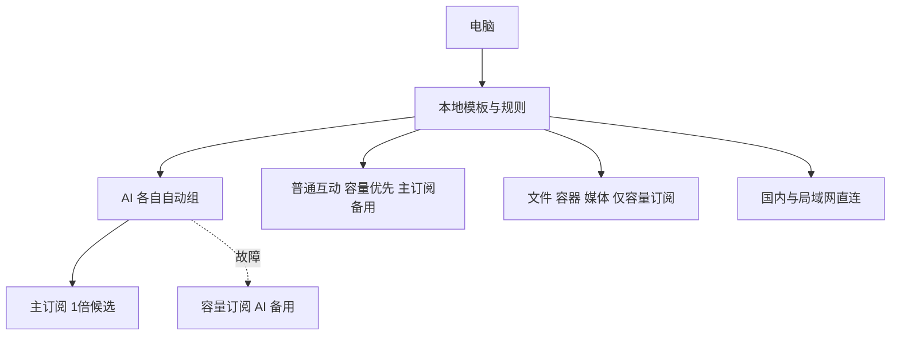
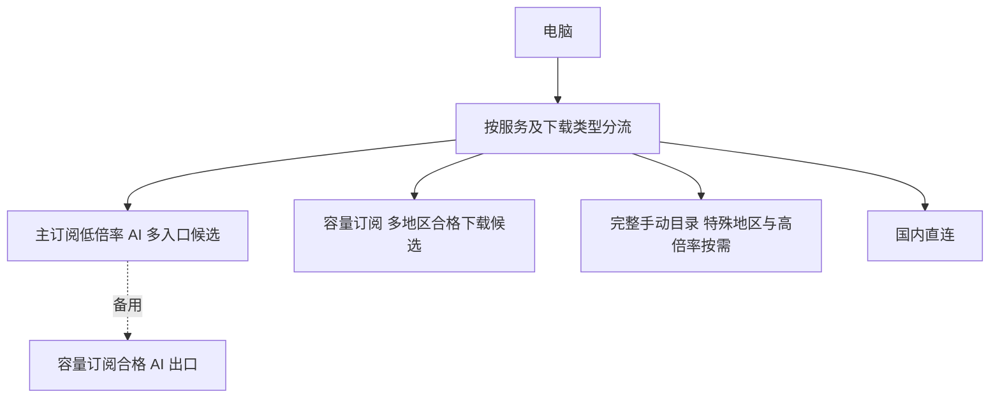
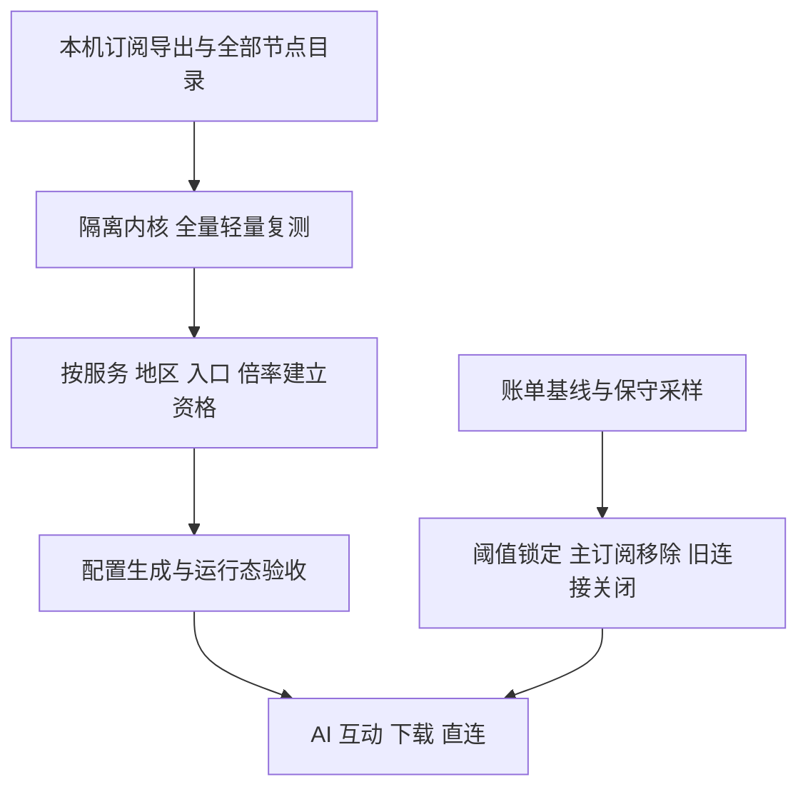

# 三档配置方式

以下金额来自案例当时提供的套餐价格，不代表供应商现价或推荐购买。主订阅 185 元 / 季、250 GB / 月；容量订阅 114 元 / 月、500 GB / 月，或升级档 219 元 / 月、999 GB / 月。临时订阅的既有费用未知，不纳入长期月成本；没有购买新服务。

## 省心：已有套餐，按用途分流

| 服务 | 出口 |
|---|---|
| 核心及自动 AI | 已验收主订阅 → 已验收容量订阅 |
| 手动 AI | 选择合格低倍率节点；自动检查不足时不假装自动可用 |
| 开发、GitHub API、X / Telegram | 容量订阅 → 主订阅低倍率 |
| 下载、镜像、模型、视频 | 仅容量订阅 |
| 国内 / 局域网 | DIRECT |

| 月成本项目 | 人民币 | 美元 |
|---|---:|---:|
| 主订阅季度分摊 | ¥61.67 | $0 |
| 容量订阅 500 GB | ¥114.00 | $0 |
| 合计 | **¥175.67** | **$0** |

安全检查：公开模板不含真实服务器与凭据，禁止正式配置使用演示节点，默认不允许 LAN，默认拒绝关闭证书校验的来源。真实来源若只能关闭证书校验，须在本机显式设置 `allow_insecure` 并记下风险，不能把该来源标为证书信任已通过。示例的证书信任不构成真实机场验收。

实施步骤：导出订阅 → 全量建目录、候选轻量测试 → 填写逐服务资格与倍率 → 构建、内核检查 → 本地导入 → 业务与三轮测量 → 晚高峰另测。接近账单阈值时执行锁定配置流程。

## 均衡：扩大容量，保留按服务资格

| 服务 | 出口 |
|---|---|
| AI | 同省心档；增加经过实测的不同入口候选 |
| 日常互动 | 容量优先，主订阅低倍率备用 |
| 下载 / 模型 / 媒体 | 容量自动池，按目的地实测排序；不增加主订阅自动备用 |
| 地区限定服务 / 高倍率家宽 | 完整目录手动选择，并观察对应扣量 |
| 国内 | DIRECT |

| 月成本项目 | 人民币 | 美元 |
|---|---:|---:|
| 主订阅季度分摊 | ¥61.67 | $0 |
| 容量订阅 999 GB 升级档 | ¥219.00 | $0 |
| 合计 | **¥280.67** | **$0** |

安全检查：沿用省心档，新增候选必须对应真实出口、目标服务及不同故障入口。容量套餐升级不提升出口信誉，也不保证速度。本档尚未购买或部署升级套餐。

实施步骤：先观察普通流量的一个完整账期 → 确认 500 GB 是否不够 → 如有必要按自己的预算购买升级档 → 更新账单基线 → 在同一分流结构增加合格容量候选 → 重测规则、自动备用和实际带宽。

## 折腾：持续复测与后台保护

| 服务 | 出口 |
|---|---|
| AI | 逐服务已验收主订阅 → 合格容量备用；状态改变后重新验收 |
| 互动 | 容量优先，主订阅低倍率备用；按业务端点监测 |
| 下载 | 仅容量；可另评估按目标一致分配，但不叠加单连接带宽 |
| 主订阅达到阈值 | 自动与手动入口锁定，只保留其他来源 |
| 国内 | DIRECT；DNS / TUN 独立复测 |

| 月成本项目 | 人民币 | 美元 |
|---|---:|---:|
| 主订阅 + 500 GB 容量订阅 | **¥175.67** | **$0** |
| 如使用 999 GB 容量档 | **¥280.67** | **$0** |
| 本机运行工具 | ¥0 新增服务费用 | $0 |

安全检查：控制接口只在本机或受控命名管道开放，凭据与状态文件不公开；核心计数重置时保护保持锁定；未知流量采用保守计费上界。采样保护仍不等于供应商硬限额。公开版提供[实测排序与后台监测](policy-monitoring.md)，需要本机节点证据、完整运行配置和当前账单；全量扫描与自动账单采集仍需另外完成。

实施步骤：在省心档基础上建立全量测试目录 → 编写与本机控制器匹配的隔离扫描流程 → 实测后更新资格 → 对比运行态 → 接入可信账单基线与保守采样 → 在隔离内核验证入口故障、全部主订阅故障、全部容量故障与阈值关闭旧连接 → 才允许保护程序管理正式核心。
