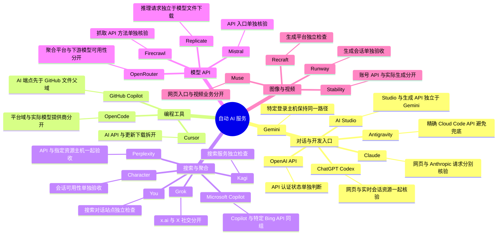
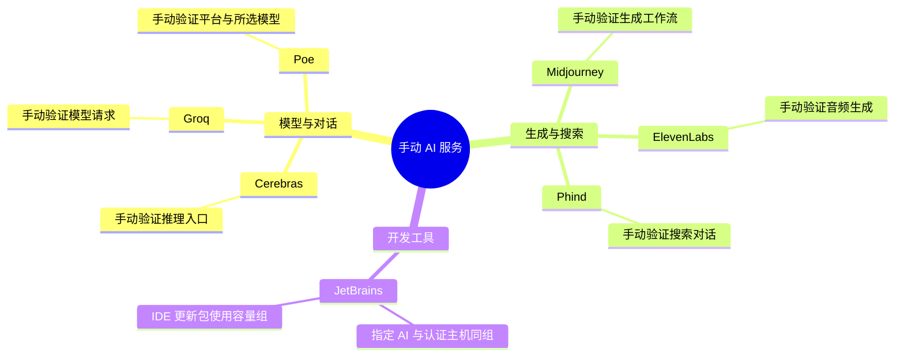
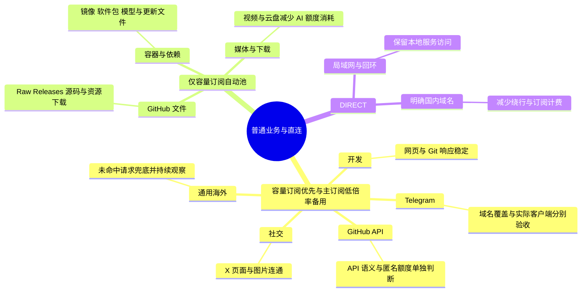
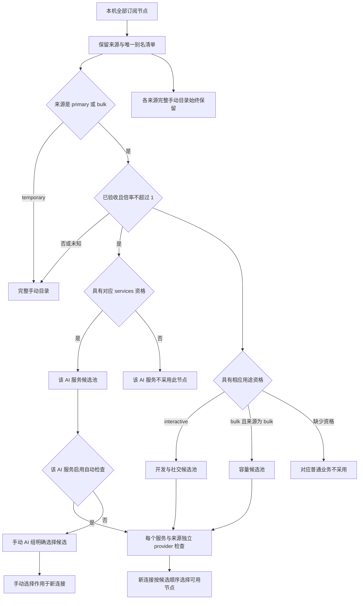
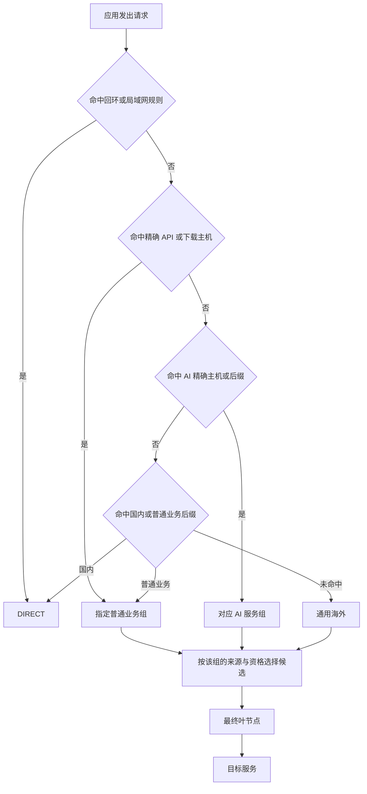

# 分类思维导图与节点选择理由

本文对应 `catalog/services.json`、`catalog/routes.json` 与 `tools/build.py`：30 个 AI 组、8 个普通业务组、DIRECT 和各来源的完整手动目录。分类先决定请求用途，再决定候选资格与出口顺序。

图中的节点是服务或策略分类。用户的真实机场节点需要由 Agent 根据本机全部节点清单，用脱敏别名补入各服务池；同一节点可以具备多个服务资格，自动服务池之间独立检查。

## 1. AI 分类：每个服务分别验收

下图覆盖 23 个自动服务。所有分支都采用 **primary 合格候选 → bulk 合格候选**，倍率不超过 1；这里的分类用于解释用途，各服务在实际配置中都有独立组与检查对象。

### 每个自动组为什么存在

| 服务 ID → 实际组名 | 分类依据与验证重点 |
|---|---|
| `chatgpt` → AI ChatGPT Codex | 对话、Codex 与专属静态 / 用户资源、LiveKit 主机归属一致；主域可达不替代登录、实时会话和上传验证。 |
| `openai` → AI OpenAI API | OpenAI API 单独检查，避免 ChatGPT 网页正常掩盖 API 故障；预期匿名 401 不等于带账号的推理成功。 |
| `claude` → AI Claude | Claude 页面与 Anthropic API、用户资源相关；HEAD 405 和实际生成分别判断。 |
| `gemini` → AI Gemini | Gemini 与指定 Google 登录 / OAuth 主机同组；这些共享身份主机也可能影响其他 Google 登录，需要复测。 |
| `aistudio` → AI Studio | AI Studio、开发入口和生成 API 的主机独立于 Gemini 页面；不能从一个页面结果推断另一个接口。 |
| `antigravity` → AI Antigravity | Cloud Code、Code Assist 与 daily sandbox API 使用精确主机，避免地区敏感 API 落入通用海外。 |
| `copilot` → AI GitHub Copilot | Copilot API 和专属代理主机先于 GitHub 普通父域，AI 资格与网页 / Git / 下载分开。 |
| `cursor` → AI Cursor | Cursor API 使用 AI 池；更新包主机先走容量组，控制更新下载的计费量。 |
| `perplexity` → AI Perplexity | Perplexity / pplx 与已知资源租户同组；仅指定 Cloudinary 主机，不扩大到共享父域。 |
| `mistral` → AI Mistral | 模型 API 与平台独立检查；匿名模型列表响应不能代替推理。 |
| `grok` → AI Grok | grok.com / x.ai 是 AI 用途，x.com / twitter.com 是社交用途，避免整个社交流量使用 AI 主订阅。 |
| `openrouter` → AI OpenRouter | 聚合平台有独立网络入口；某个模型是否可用还取决于账号与提供商。 |
| `mscopilot` → AI Microsoft Copilot | Copilot 域和特定 Bing 接口同组；不把所有 Microsoft / Bing 域都归为 AI。 |
| `character` → AI Character | 独立对话平台，按其业务验收，不借用其他 AI 的节点资格。 |
| `runway` → AI Runway | 视频生成平台独立检查；网页重定向、生成和大文件分别验收。 |
| `stability` → AI Stability | 账号接口检查与图像生成不同；匿名 401 只记录接口网络与语义。 |
| `replicate` → AI Replicate | 推理平台域使用 AI 池；模型文件类域走容量组，同主机内不同 URL 路径无法靠域名规则拆分。 |
| `you` → AI You | 搜索 / 对话用途保留独立服务资格，首页可达后仍需业务验证。 |
| `kagi` → AI Kagi | 搜索服务独立检查；账号访问与实际查询单独验收。 |
| `recraft` → AI Recraft | 图像生成平台独立选择与检查，生成、资源和上传范围分别记录。 |
| `muse` → AI Muse | 视频平台网页检查只说明入口，视频业务与长连接需要另测。 |
| `firecrawl` → AI Firecrawl | API 抓取服务独立分组；方法不支持的 405 与实际调用分别验证。 |
| `opencode` → AI OpenCode | opencode.ai 平台域独立分组；客户端调用其他模型提供商时，按实际目标域进入对应服务组。 |

这些理由说明分类的目的，不代表所有服务具有相同地区政策。候选的适用地区、出口稳定性、第三方信誉和账号业务要按服务、日期重新核验。

## 2. 手动 AI：保留可见的选择与未验收状态

七个服务在目录中设置为 `auto: false`，没有定义自动检查端点。它们仍有域名规则和服务组，使用逐服务合格、低倍率的 primary / bulk 候选；不会把没有证据的节点放进自动备用。

| 服务 ID → 实际组名 | 手动分支的设计原因 |
|---|---|
| `cerebras` → AI Cerebras 手动 | 目录没有自动判活契约，实际推理请求需要验证后选择候选。 |
| `groq` → AI Groq 手动 | 模型入口与账号请求需要单独验证，保留明确的人工选择。 |
| `poe` → AI Poe 手动 | 平台连接与具体模型不同，不能用一个通用检查替代。 |
| `midjourney` → AI Midjourney 手动 | 生成工作流需要单独验收，当前目录没有稳定的自动判活定义。 |
| `elevenlabs` → AI ElevenLabs 手动 | 音频生成、上传与长连接分别验收，当前不做自动故障切换。 |
| `phind` → AI Phind 手动 | 搜索 / 对话业务单独验证，目录保留手动组。 |
| `jetbrains` → AI JetBrains 手动 | JetBrains AI、Grazie 与指定账号主机同组；普通 IDE 文档走开发，安装包走容量。 |

手动服务也受生成器资格过滤。没有合格候选时组里只有 `REJECT`，不能用“有一个服务组”宣称已经支持该业务。

## 3. 普通业务：互动响应和大流量分别安排

| 实际组 / 目标 | 出口顺序 | 为什么拆成这个分支 |
|---|---|---|
| 开发 | bulk → primary；均需 `interactive` 资格 | GitHub 网页 / Git、GitLab、文档、问答等互动用途，重视响应和连通。 |
| GitHub API | bulk → primary；均需 `interactive` 资格 | `api.github.com` 精确分组，避免网页判活掩盖 API 超时或匿名额度耗尽。 |
| 社交 | bulk → primary；均需 `interactive` 资格 | X / Twitter、短链接和图片日常访问，容量来源优先。 |
| Telegram | bulk → primary；均需 `interactive` 资格 | 域名类请求独立检查；客户端 IP 连接、IPv6、语音和通话另验收，公开模板目前没有完整网段规则。 |
| 通用海外 | bulk → primary；均需 `interactive` 资格 | `MATCH` 最后兜底；新发现的重要业务应补精确规则，不能把兜底长期当作逐服务验收。 |
| GitHub 文件 | bulk；需 `bulk` 资格 | Raw、Releases、源码、对象与头像等文件统一使用容量来源，避免挤占 AI 主订阅。 |
| 容器与依赖 | bulk；需 `bulk` 资格 | Docker / OCI 镜像、软件包、模型文件、软件更新等大流量用途。Registry 401 需判断是否为认证挑战。 |
| 媒体与下载 | bulk；需 `bulk` 资格 | X 视频、YouTube、Twitch、云盘等流量较大；轻量判活不能替代视频或下载带宽验收。 |
| DIRECT | 不经过机场候选 | 回环、局域网与目录内明确国内域名直连；模板没有完整国内 IP 库，不能承诺全部国内请求直连。 |

## 4. 一个机场节点如何进入多个服务池

| 分支 | 设计理由与实际行为 |
|---|---|
| primary | AI 组放在 bulk 前；普通互动组放在 bulk 后；不进入容量组。 |
| bulk | 提供 AI 备用、普通互动主力和下载容量；AI 备用也必须有该服务资格。 |
| temporary | 仅完整手动目录，避免临近到期来源悄悄成为自动出口。 |
| 已验收且倍率 ≤ 1 | 自动候选的成本与资格门槛；真实 5 倍率节点不能填成 1。 |
| `services` | 决定哪个 AI 组可以使用该节点；ChatGPT 合格不自动等于 Claude / Gemini 合格。 |
| `roles` | 分别决定互动或容量用途，与 `services` 独立；一个节点可同时具备多种资格。 |
| 全部节点目录 | 包含未映射、高倍率、未验收及临时节点，保留试验与本机手动调整入口；选中这个目录不会自动改变既有业务组的出口。 |
| 候选顺序 | 同来源按 `nodes` 中的映射顺序排列；fallback 按配置顺序选可用候选，不自动挑延迟最低。 |
| 独立检查 | 相同叶节点可复制进多个服务 provider；减少某个服务检查状态影响另一个服务，仍需业务请求验收。 |
| 没有合格候选 | 生成 `select: [REJECT]`，显式拒绝；Agent 应说明原因并补齐用户需要的服务资格。 |

正式生成 `--block-primary` 时，从自动组、节点列表和 primary 手动目录移除主来源。它需要重建、部署和旧连接处理；公开生成器没有自动账单监控。

## 5. 请求按什么顺序流转

| 需要优先匹配的请求 | 实际归属 | 设计原因 |
|---|---|---|
| `downloads.cursor.com` / `api.cursor.com` | 容器与依赖 / AI Cursor | 更新包与 API 分开，精确下载规则先于 `cursor.com`。 |
| `copilot-proxy.githubusercontent.com` / `raw.githubusercontent.com` | AI GitHub Copilot / GitHub 文件 | AI 专用主机先于普通文件父域；Raw 先进入容量组。 |
| `api.github.com` / `github.com` | GitHub API / 开发 | API 错误和网页连接分开观察。 |
| `registry.gitlab.com` / `gitlab.com` | 容器与依赖 / 开发 | 容器镜像与开发网页分别选择出口。 |
| `download.jetbrains.com` / `api.jetbrains.cloud` / `jetbrains.com` | 容器与依赖 / AI JetBrains 手动 / 开发 | 安装包、AI API 和文档三个用途分开。 |
| `video.twimg.com` / 其他 `twimg.com` | 媒体与下载 / 社交 | 视频优先容量，图片保留互动用途。 |
| `daily-cloudcode-pa.sandbox.googleapis.com` | AI Antigravity | 精确 API 规则避免进入通用海外；不扩大到整个 `googleapis.com`。 |

同一 HTTPS 主机的聊天、附件和下载不能靠域名规则区分，可能仍共用 AI 出口；共享云、认证、支付和 CDN 父域不能因某个租户使用就全部加入 AI。更多边界见[规则说明](rules.md)。

## 图与配置如何保持一致

修改服务或普通业务目录时，同时更新本文的对应分支、理由与首匹配例子，并补充规则边界测试。组名、自动 / 手动属性和候选筛选以生成器为准；本机图按实际部署后的运行态补充节点别名与结果。

图采用 GitHub 支持的 Mermaid 代码块；维护格式参考 [GitHub 图表说明](https://docs.github.com/en/get-started/writing-on-github/working-with-advanced-formatting/creating-diagrams)与 [Mermaid 思维导图语法](https://mermaid.js.org/syntax/mindmap.html)。
